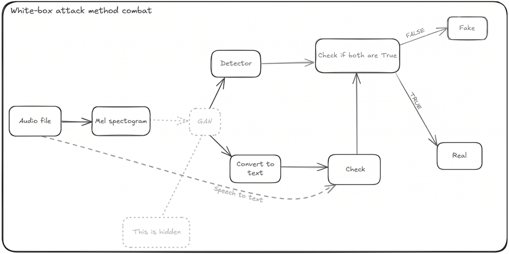

# Multi-Layered Semantic Validation: A Defense-in-Depth Approach against White-Box Adversarial Attacks on Deepfake Audio

## Project Overview
This project implements a multi-layered verification framework designed to protect deepfake audio detection systems from white-box adversarial attacks. While traditional models often suffer from a "Generalization Gap"—collapsing from 99% accuracy to below 1% when facing unknown attacks—this system utilizes a "Defense-in-Depth" approach.

The core innovation is the discovery of a **"phonetic boundary"**: perturbations that successfully fool an acoustic detector almost invariably corrupt the linguistic coherence of the audio, allowing a Speech-to-Text (STT) layer to neutralize the attack.

## System Architecture
The framework processes audio through two parallel verification branches:

### 1. Acoustic Discriminator (ResNet18 + Bi-GRU)
A hybrid architecture designed to capture both instantaneous spectral anomalies and long-range prosodic inconsistencies.
* **Backbone**: A ResNet18 pre-trained on ImageNet serves as the spatial feature extractor for 2-channel Mel spectrograms.
* **Temporal Module**: A Bidirectional Gated Recurrent Unit (Bi-GRU) models temporal dynamics and dependencies between past and future spectral frames.
* **Attention Head**: Uses a learned Attention Pooling mechanism to aggregate recurrent output into a single fixed-length vector for final binary classification.

### 2. Linguistic Verification Layer (Whisper STT)
* **Model**: Uses the Whisper base model to transcribe raw audio.
* **Validation**: Compares the resulting transcript against a reference transcription using a linguistic similarity score.
* **Threshold**: A sample is only accepted as authentic if the similarity score is greater than or equal to 0.8.

## Adversarial Scenarios & Results
The system was evaluated against a white-box attacker using an enhanced Pix2Pix strategy.

| Scenario | Discriminator Training Type | Result |
| :--- | :--- | :--- |
| **Scenario 1** | Trained exclusively on spoofed samples. | 100% Attack Success Rate (ASR) within 500 epochs. |
| **Scenario 2** | Trained on balanced (Real + Fake) data. | Immediate 100% ASR within the first training epoch. |

**The Defense Result**: Even when the attacker reached a 97.4% credibility score against the acoustic branch, the Whisper STT branch rejected 100% of these attacks because the generated spectrograms were phonetically incoherent.

## 📈 Generalization Performance
The hybrid model significantly improves performance on external, non-homogeneous data.

* **Standalone Discriminator**: Achieved only 2% recall on external real recordings due to channel bias.
* **Hybrid System**: Boosted Bonafide Recall to 81% on external data by using the STT layer to validate samples that the acoustic branch misclassified as fake.

## 🛠️ Implementation Details
* **Standardization**: Audio is standardized to 4 seconds at 16 kHz.
* **Features**: Short-time Fourier Transform (STFT) with a window size of 780 and hop_length of 195.
* **Optimizer**: Adam optimizer with a OneCycleLR scheduler.
